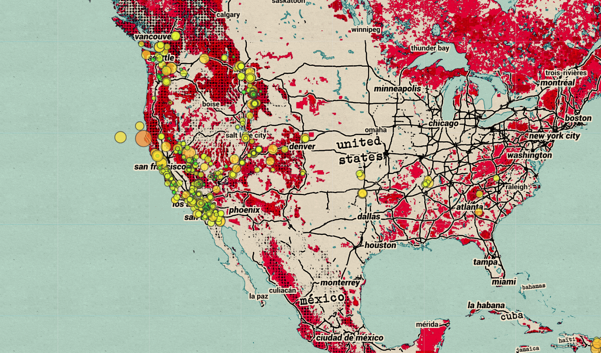

# USGS Leaflet
## Summary
* A homework assignment for UC Berkeley's Data Analytics Bootcamp
* Creates an interactive map that plots earthquake data from the past 7 days
* Data comes from [The United States Geological Survey's API](https://earthquake.usgs.gov/earthquakes/feed/v1.0/geojson.php)
* Maps are created using [Mapbox](https://www.mapbox.com/)
* Web application is deployed here: https://mileslucey.github.io/usgs_leaflet/

